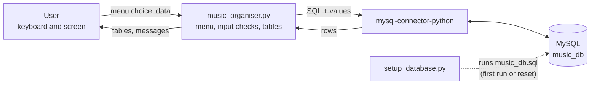
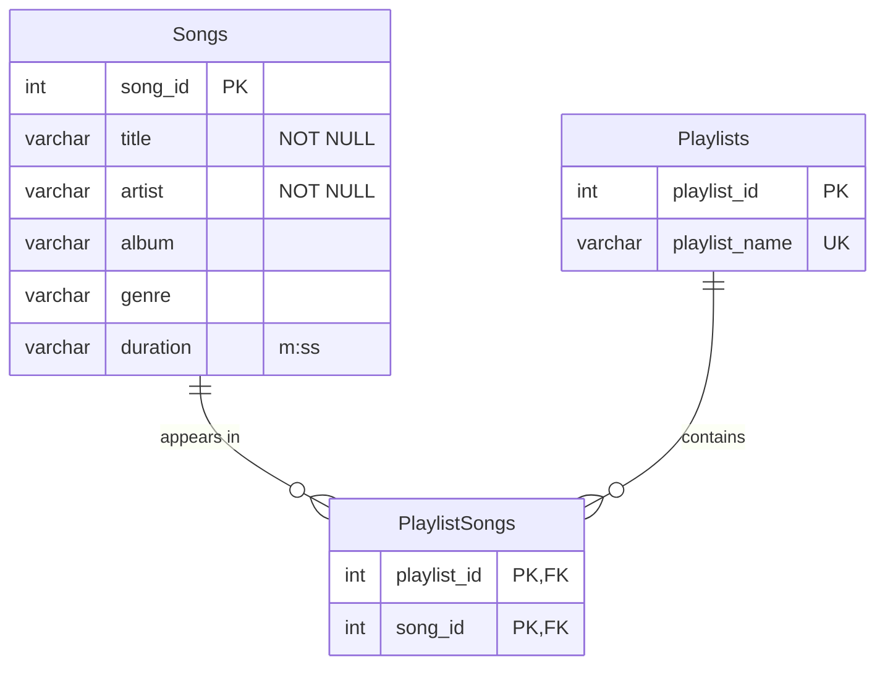

# 🎵 Music / Playlist Organiser

A menu-driven **Python + MySQL** console application for organising a music collection:
add, view, search, update and delete songs, build playlists, and see each playlist's
total running time.


📘 **[Project Introduction (PDF)](docs/project-introduction.pdf)**: overview, features and database design, with diagrams<br>
🖥️ **[Working Output (PDF)](docs/working-output.pdf)**: real captured output of every feature and of the 12 MySQL queries

## Contents

- [Abstract](#abstract)
- [Features](#features)
- [Sample output](#sample-output)
- [How it works](#how-it-works)
- [Database design](#database-design)
- [Project structure](#project-structure)
- [Getting started](#getting-started)
- [Testing](#testing)
- [Improvements over the report's code](#improvements-over-the-reports-code)
- [Known limitations](#known-limitations)
- [Future scope](#future-scope)

## Abstract

The project “Music / Playlist Organiser” is a database application developed
using Python as the front-end programming language and MySQL as the back-end
database. In today’s world, music plays an important role in entertainment
and relaxation, and people often have a large digital music collection.
Managing these songs manually becomes difficult, especially when it comes to
searching for tracks, categorising them, or creating playlists. This project
addresses that problem by providing an efficient way to organise songs and
playlists through a computerised system.

The system provides a menu-driven interface that allows the user to:

- Add new songs with details like title, artist, album, genre, and duration.
- View all songs stored in the database in a tabular format.
- Search songs by title, artist, or genre.
- Update song details if changes are needed.
- Delete songs that are no longer required.
- Create playlists and add songs to them.
- View all songs belonging to a specific playlist.

The Python program is used to take input from the user, display outputs, and
connect to the database using the mysql.connector library. The MySQL database
is used to store, update, and retrieve records, ensuring structured data
management. The project demonstrates how to perform CRUD operations (Create,
Read, Update, Delete), use foreign keys for linking tables (songs and
playlists), and manage relationships between data.

The objective of this project is not only to build a useful application but
also to give students practical exposure to the real-life use of Python with
SQL databases. By implementing this project, students learn about database
connectivity, SQL query execution, error handling, and modular programming in
Python. The project also simulates how popular music applications such as
Spotify, iTunes, or Wynk manage their backend operations.

In conclusion, the Music / Playlist Organiser project combines simplicity with
functionality, providing an easy-to-use platform to manage a music collection.
It highlights the importance of database applications in solving real-world
problems and demonstrates how Python and SQL can be integrated to create
efficient software solutions.

## Features

| # | Menu option | What it does |
|:-:|---|---|
| 1 | **Add Song** | Asks for title, artist, album, genre and duration, and warns if the song is already stored |
| 2 | **View Songs** | Lists every song in a table, with a total count |
| 3 | **Search Song** | Finds songs whose title, artist or genre contains a keyword |
| 4 | **Update Song** | Shows the current details; press Enter to keep any value |
| 5 | **Delete Song** | Asks to confirm, then removes the song and its playlist entries |
| 6 | **Create Playlist** | Creates a playlist; names must be unique |
| 7 | **Add Song to Playlist** | Lists the playlists, then links a song to the chosen one |
| 8 | **View Playlist** | Shows a playlist's songs with the song count and total time |
| 9 | **Exit** | Ends the program |

The program also:

- **Checks input.** Title and artist are required, text must fit its column, and a duration must look like `3:45`.
- **Prevents duplicates.** It warns before adding a song twice and refuses duplicate playlist names or the same song twice in a playlist.
- **Explains problems.** A wrong password, a stopped MySQL server or a missing table produce a message that says what to fix, not a crash.
- **Sets itself up.** On the first run it offers to create the database with 30 sample songs and 6 playlists.
- **Keeps SQL safe.** Typed values are passed to MySQL as query parameters (`%s`), so input cannot inject SQL.

## Sample output

Captured from a real run; the [Working Output PDF](docs/working-output.pdf) shows every feature.

**Adding a song**

```text
Enter your choice: 1
Enter Song Title: Is There Someone Else?
Enter Artist: The Weeknd
Enter Album: Dawn FM
Enter Genre: R&B
Enter Duration (mm:ss): 3:19

✅ Song added successfully! (Song ID: 31)
```

**Viewing a playlist**

```text
Enter Playlist ID: 7

📂 Playlist: Late Night Drive

+------+------------------------+--------------+---------------------------------------+-----------+------------+
| ID   | Title                  | Artist       | Album                                 | Genre     | Duration   |
+======+========================+==============+=======================================+===========+============+
| 3    | Starboy                | The Weeknd   | Starboy                               | Pop       | 3:50       |
+------+------------------------+--------------+---------------------------------------+-----------+------------+
| 31   | Is There Someone Else? | The Weeknd   | Dawn FM                               | Synth-pop | 3:19       |
+------+------------------------+--------------+---------------------------------------+-----------+------------+
| 32   | Hotel                  | Montell Fish | Her Love Still Haunts Me Like A Ghost | R&B       | 3:17       |
+------+------------------------+--------------+---------------------------------------+-----------+------------+
3 song(s), total time 10:26
```

## How it works



1. The program shows the menu and the user picks an option, for example *3. Search Song*.
2. Python reads and checks the input, then builds an SQL query. The typed values are passed separately as parameters.
3. `mysql.connector` sends the query to the MySQL server, which runs it on `music_db`.
4. MySQL returns the matching rows. Python formats them as a table with `tabulate`, prints them, and shows the menu again.

Each feature opens a connection, does its work, saves changes with `commit()`, and closes the
connection, even if something goes wrong part-way.

## Database design

A song can be in many playlists and a playlist holds many songs, so a third table,
`PlaylistSongs`, links them (a many-to-many relationship).



| Table | Stores | Keys |
|---|---|---|
| `Songs` | One row per song: title, artist, album, genre, duration | `song_id` primary key, auto-numbered |
| `Playlists` | One row per playlist | `playlist_id` primary key; `playlist_name` unique |
| `PlaylistSongs` | One row per song-in-playlist link | (`playlist_id`, `song_id`) primary key; both are foreign keys |

Both foreign keys use `ON DELETE CASCADE`: deleting a song also removes its rows from
`PlaylistSongs`. Without it, MySQL would refuse to delete any song that is in a playlist.

## Project structure

```text
music-playlist-organizer/
├── music_organiser.py       # main program: the menu and all nine features
├── setup_database.py        # creates or resets music_db from music_db.sql
├── db_config.example.py     # template for db_config.py (MySQL username and password)
├── music_db.sql             # the three tables + 30 sample songs and 6 playlists
├── sample_queries.sql       # 12 example SQL queries on the sample data
├── requirements.txt         # mysql-connector-python, tabulate
└── docs/
    ├── project-introduction.pdf
    └── working-output.pdf
```

## Getting started

### Prerequisites

- **Python** 3.8 or later
- **MySQL Server** 8.0 or later, installed and running
  ([download](https://dev.mysql.com/downloads/mysql/))

### Installation

1. **Get the code**

   ```bash
   git clone https://github.com/vjxeyy/music-playlist-organizer.git
   cd music-playlist-organizer
   ```

2. **Install the Python libraries**

   ```bash
   pip install -r requirements.txt
   ```

3. **Add your MySQL login.** Copy the template, then put your MySQL password in `db_config.py`:

   ```bash
   copy db_config.example.py db_config.py     # Windows
   cp db_config.example.py db_config.py       # macOS / Linux
   ```

   `db_config.py` is listed in `.gitignore`, so your password is never committed.

4. **Run the program**

   ```bash
   python music_organiser.py
   ```

   On the first run it says the database does not exist yet; answer **y** to create it
   with the sample data. (You can also create it by running `music_db.sql` in MySQL Workbench.)

### Usage

Choose an option by typing its number:

```text
====== MUSIC / PLAYLIST ORGANISER ======
1. Add Song
2. View Songs
3. Search Song
4. Update Song
5. Delete Song
6. Create Playlist
7. Add Song to Playlist
8. View Playlist
9. Exit
Enter your choice:
```

To restore the original sample data at any time (for example before taking screenshots), run
`python setup_database.py`. This replaces all songs and playlists.

## Testing

Tested on Windows 11 with Python 3.14.5, MySQL Server 26.7.0, mysql-connector-python 26.7.0
and tabulate 0.10.0.

An automated script ran **77 checks, all passing**. They covered every menu option with valid
input, invalid input, boundary values (such as 100 and 101 characters), SQL injection
attempts, emoji and accented text, and connection failures. Every check is listed in section 5
of the [Working Output PDF](docs/working-output.pdf). The test script itself is not part of
this repository.

## Improvements over the report's code

The program keeps the report's structure (same tables, functions and menu) and fixes these
problems. The most important: in the report's version, **Delete Song failed with MySQL
error 1451 for every sample song**, because all 30 are in a playlist.

<details>
<summary>Show all changes</summary>

**Database (`music_db.sql`)**
- `PlaylistSongs` foreign keys use `ON DELETE CASCADE`, so songs in playlists can be deleted.
- `PlaylistSongs` has a primary key (`playlist_id`, `song_id`), so a song cannot be added to
  the same playlist twice.
- Playlist names are `UNIQUE`.
- The script starts with `DROP DATABASE IF EXISTS`, so it can be run again, and uses
  `utf8mb4` so titles like *Don’t Start Now* are stored correctly.
- The example queries are in their own file, `sample_queries.sql`.

**Python (`music_organiser.py`)**
- `tabulate` is listed as a requirement; the report's code imports it but only lists
  `mysql-connector-python`.
- The MySQL login is kept in `db_config.py` (not committed), with `db_config.example.py`
  as a template.
- A wrong password or a stopped MySQL server shows a clear message instead of a crash.
- **Update Song** edits every field (press Enter to keep a value). The report's version only
  changed title and artist, and reported success even for a Song ID that does not exist.
- **Delete Song** shows the song and asks for confirmation first.
- **Add Song to Playlist** and **View Playlist** list the playlists before asking for an ID.
  A wrong ID or a duplicate gives a message; in the report's version it crashed the program.
- Input is checked: title and artist are required, text must fit its column, and duration
  must look like `3:45`.
- **Add Song** warns when the same title and artist are already stored.
- **Search Song** treats `%` and `_` as ordinary characters; in the report's version,
  searching `%` listed every song.
- Yes/no questions accept `y` or `yes`.
- **View Playlist** also shows the number of songs and the total time.

**Setup (`setup_database.py`)**
- Refuses to run if `music_db.sql` creates a different database from `DB_NAME` in
  `db_config.py`, instead of silently dropping it.
- Works even if `music_db.sql` was saved with a UTF-8 byte-order mark.
- If a table goes missing, the error message says how to rebuild it.

</details>

## Known limitations

- `duration` is stored as text (`'3:20'`), as in the report. Sample queries 8, 9 and 11 compare
  it as text, which works while every song is under 10 minutes (`'10:00'` sorts before `'9:59'`).
- **Update Song** cannot clear an album or genre back to blank.
- Searching `dont` does not find *Don’t Start Now*, because that title uses a curly apostrophe.

## Future scope

- **User accounts:** log in so each person has their own songs and playlists.
- **Playlist sharing:** let users share playlists with each other.
- **Graphical interface:** windows and buttons (for example with Tkinter) instead of a text menu.
- **More playlist tools:** remove a song from a playlist, and rename or delete a playlist.
- **Duration in seconds:** store duration as a number so sorting and comparing work for songs of any length.
