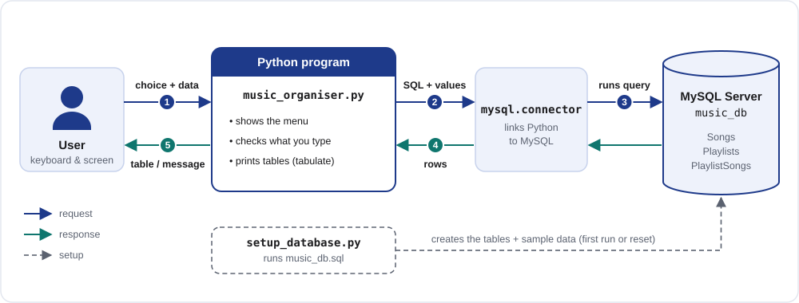
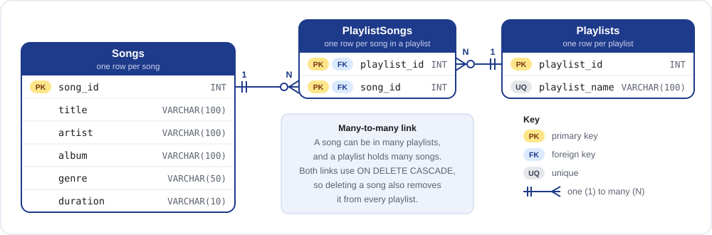

# 🎵 Music / Playlist Organiser

> 🎓 **My Class 12 Board Computer Science project**, built with Python and MySQL.

A **Python and MySQL-based database application** designed to efficiently manage songs and
playlists through a simple, menu-driven interface.

The project demonstrates how **Python can be integrated with a MySQL database** to perform data
storage, retrieval, updating, and deletion while maintaining relationships between songs and
playlists.

[](#️-tech-stack)

📘 **[Project Introduction (PDF)](docs/project-introduction.pdf)**: overview, features and database design, with diagrams<br>
🖥️ **[Working Output (PDF)](docs/working-output.pdf)**: real captured output of every feature and of the 12 MySQL queries

---

## 📌 About the Project

Managing a large collection of songs manually can become difficult, especially when searching
for tracks, categorising songs, or organising them into playlists.

The **Music / Playlist Organiser** provides a computerised solution for managing a music
collection. The application uses **Python as the front-end** and **MySQL as the back-end
database**.

The system allows users to manage song information, create playlists, add songs to playlists,
and view playlist contents through a straightforward menu-driven interface.

This project also provides practical experience with **database connectivity, SQL queries,
CRUD operations, foreign keys, and modular programming in Python**.

<details>
<summary>Read the full abstract from the project report</summary>

The project “Music / Playlist Organiser” is a database application developed
using Python as the front-end programming language and MySQL as the back-end
database. In today’s world, music plays an important role in entertainment
and relaxation, and people often have a large digital music collection.
Managing these songs manually becomes difficult, especially when it comes to
searching for tracks, categorising them, or creating playlists. This project
addresses that problem by providing an efficient way to organise songs and
playlists through a computerised system.

The system provides a menu-driven interface that allows the user to:

- Add new songs with details like title, artist, album, genre, and duration.
- View all songs stored in the database in a tabular format.
- Search songs by title, artist, or genre.
- Update song details if changes are needed.
- Delete songs that are no longer required.
- Create playlists and add songs to them.
- View all songs belonging to a specific playlist.

The Python program is used to take input from the user, display outputs, and
connect to the database using the mysql.connector library. The MySQL database
is used to store, update, and retrieve records, ensuring structured data
management. The project demonstrates how to perform CRUD operations (Create,
Read, Update, Delete), use foreign keys for linking tables (songs and
playlists), and manage relationships between data.

The objective of this project is not only to build a useful application but
also to give students practical exposure to the real-life use of Python with
SQL databases. By implementing this project, students learn about database
connectivity, SQL query execution, error handling, and modular programming in
Python. The project also simulates how popular music applications such as
Spotify, iTunes, or Wynk manage their backend operations.

In conclusion, the Music / Playlist Organiser project combines simplicity with
functionality, providing an easy-to-use platform to manage a music collection.
It highlights the importance of database applications in solving real-world
problems and demonstrates how Python and SQL can be integrated to create
efficient software solutions.

</details>

---

## ✨ Features

### 🎵 Song Management
- Add new songs
- View all songs
- Search songs by:
  - Title
  - Artist
  - Genre
- Update song details
- Delete songs

### 📂 Playlist Management
- Create new playlists
- Add songs to playlists
- View songs belonging to a specific playlist, with the song count and total time

### 🗄️ Database Operations
- Create and manage a MySQL database
- Perform CRUD operations
- Execute SQL queries
- Maintain relationships between database tables
- Use foreign keys to connect songs and playlists

### 🛡️ Built-in Checks
- Title and artist are required, text must fit its column, and a duration must look like `3:45`
- Warns before adding a song that is already stored; refuses duplicate playlist names and the same song twice in a playlist
- A wrong password, a stopped MySQL server or a missing table give a message that says what to fix, not a crash
- On the first run, offers to create the database with 30 sample songs and 6 playlists
- Typed values are sent to MySQL as query parameters, so input cannot inject SQL

---

## 🛠️ Tech Stack

| Technology | Purpose |
|---|---|
| **Python** | Front-end / application logic |
| **MySQL** | Back-end database |
| **mysql-connector-python** | Python–MySQL database connectivity |
| **Tabulate** | Displaying database records in tabular format |

The project uses Python to accept user input and display results, while MySQL is responsible
for storing, updating, and retrieving the data.

---

## 🏗️ Project Architecture

```text
             ┌─────────────────────┐
             │        User         │
             └──────────┬──────────┘
                        │
                        ▼
             ┌─────────────────────┐
             │       Python        │
             │  Menu-Driven App    │
             └──────────┬──────────┘
                        │
              mysql.connector
                        │
                        ▼
             ┌─────────────────────┐
             │        MySQL        │
             │      music_db       │
             └──────────┬──────────┘
                        │
          ┌─────────────┼─────────────┐
          ▼             ▼             ▼
      ┌────────┐   ┌───────────┐   ┌───────────────┐
      │ Songs  │   │ Playlists │   │ PlaylistSongs │
      └────────┘   └───────────┘   └───────────────┘
```

The project follows a **client–server model**: the Python menu-driven program is the client
(front-end), and the MySQL server is the back-end that stores the data.

### How it works



1. **Choice + data:** the user picks a menu option and types any details, for example a song title.
2. **SQL + values:** `music_organiser.py` checks the input and builds an SQL query. The typed
   values are passed separately as parameters.
3. **Runs query:** `mysql.connector` sends the query to the MySQL server, which runs it on `music_db`.
4. **Rows:** MySQL sends back the matching rows.
5. **Table / message:** the program prints the rows as a table with `tabulate` (or a message) and
   shows the menu again.

The dashed path is setup: on the first run (or when you run `python setup_database.py`), the
code in `setup_database.py` runs `music_db.sql` to create the tables and sample data.

Each feature opens a connection, does its work, saves changes with `commit()`, and closes the
connection, even if something goes wrong part-way.

---

## 🗃️ Database Structure

The project uses a database named:

```text
music_db
```

### Entity–Relationship Diagram



### Songs

Stores information about individual songs.

```text
Songs
├── song_id        INT, primary key (auto-numbered)
├── title          VARCHAR(100), required
├── artist         VARCHAR(100), required
├── album          VARCHAR(100)
├── genre          VARCHAR(50)
└── duration       VARCHAR(10), e.g. 3:20
```

### Playlists

Stores playlist information.

```text
Playlists
├── playlist_id    INT, primary key (auto-numbered)
└── playlist_name  VARCHAR(100), unique
```

### PlaylistSongs

Connects songs with playlists and represents the relationship between them.

```text
PlaylistSongs
├── playlist_id    INT, foreign key → Playlists
└── song_id        INT, foreign key → Songs
    (playlist_id, song_id) together form the primary key
```

A song can be in many playlists and a playlist holds many songs, so `PlaylistSongs` links
them (a **many-to-many relationship**). Both foreign keys use `ON DELETE CASCADE`, so deleting
a song also removes it from every playlist.

---

## 🔄 CRUD Operations

The application demonstrates the four fundamental database operations:

| Operation | Function |
|---|---|
| **Create** | Add songs and create playlists |
| **Read** | View and search songs and playlists |
| **Update** | Update existing song details |
| **Delete** | Delete songs |

---

## 📋 Main Menu

The Python application provides the following menu:

```text
====== MUSIC / PLAYLIST ORGANISER ======
1. Add Song
2. View Songs
3. Search Song
4. Update Song
5. Delete Song
6. Create Playlist
7. Add Song to Playlist
8. View Playlist
9. Exit
Enter your choice:
```

---

## ⚙️ Requirements

### Hardware

- Intel Core i3 or higher processor
- Minimum 4 GB RAM
- 250 GB HDD or 512 GB SSD
- Standard keyboard and mouse
- Monitor with at least 1024 × 768 resolution

### Software

- Windows 10/11, Linux, or macOS
- Python 3.8 or later
- MySQL Server 8.0 or later
- Python libraries: `mysql-connector-python`, `tabulate`
- VS Code, PyCharm, or IDLE

Tested on Windows 11 with Python 3.14.5, MySQL Server 26.7.0, mysql-connector-python 26.7.0
and tabulate 0.10.0.

---

## 🚀 Installation & Setup

### 1. Clone the Repository

```bash
git clone https://github.com/vjxeyy/music-playlist-organizer.git
cd music-playlist-organizer
```

### 2. Install Required Python Libraries

```bash
pip install -r requirements.txt
```

### 3. Configure the Database Connection

Copy the template and put your MySQL username and password in the copy:

```bash
copy db_config.example.py db_config.py     # Windows
cp db_config.example.py db_config.py       # macOS / Linux
```

```python
DB_CONFIG = {
    "host": "localhost",
    "user": "root",            # your MySQL username
    "password": "your_password",
}
```

> **Note:** `db_config.py` is listed in `.gitignore`, so your password is never uploaded to GitHub.

### 4. Run the Application

```bash
python music_organiser.py
```

On the first run the program says the database does not exist yet. Answer **y** and it
creates `music_db` with the three tables and the sample data. You can also create it by
running `music_db.sql` in MySQL Workbench.

### 5. Reset the Sample Data (optional)

```bash
python setup_database.py
```

This replaces all songs and playlists with the original sample data.

---

## 📁 Project Structure

```text
music-playlist-organizer/
│
├── README.md
├── music_organiser.py       # main program: the menu and all nine features
├── setup_database.py        # creates or resets music_db from music_db.sql
├── db_config.example.py     # template for db_config.py (MySQL login)
├── music_db.sql             # the three tables + 30 sample songs and 6 playlists
├── sample_queries.sql       # 12 example SQL queries on the sample data
├── requirements.txt         # mysql-connector-python, tabulate
└── docs/
    ├── project-introduction.pdf
    ├── working-output.pdf
    └── images/
        ├── how-it-works.svg
        └── database-diagram.svg
```

---

## 🧪 Example Operations

### Add a Song

```text
Enter your choice: 1
Enter Song Title: Is There Someone Else?
Enter Artist: The Weeknd
Enter Album: Dawn FM
Enter Genre: R&B
Enter Duration (mm:ss): 3:19

✅ Song added successfully! (Song ID: 31)
```

### View Songs

The application displays stored songs in a structured table containing:

```text
ID | Title | Artist | Album | Genre | Duration
```

### View a Playlist

Users choose a playlist by its ID. The program lists the playlists first, then shows that
playlist's songs with the song count and total time. The
[Working Output PDF](docs/working-output.pdf) shows the full output of every feature.

---

## 🎯 Learning Objectives

This project provides practical experience with:

- Python programming
- MySQL database management
- Python–MySQL connectivity
- SQL query execution
- CRUD operations
- Relational database design
- Foreign keys
- Many-to-many relationships
- User input handling
- Modular programming

The project was designed to demonstrate the practical use of Python together with SQL
databases in a real-world-style application.

---

## 🔮 Future Improvements

The project can be extended with additional functionality such as:

- User authentication
- Playlist sharing
- Graphical user interface (GUI)
- More advanced playlist management (remove a song from a playlist, rename or delete a playlist)
- Additional search and filtering functionality
- Storing duration in seconds, so sorting and comparing work for songs of any length

---

## ✅ Testing

An automated script ran **77 checks, all passing**, on the setup above. They covered every
menu option with valid input, invalid input, boundary values, SQL injection attempts, emoji
and accented text, and connection failures. Every check is listed in section 5 of the
[Working Output PDF](docs/working-output.pdf). The test script itself is not part of this
repository.

<details>
<summary>Improvements over the code in the project report</summary>

The program keeps the report's structure (same tables, functions and menu) and fixes these
problems. The most important: in the report's version, **Delete Song failed with MySQL error
1451 for every sample song**, because all 30 are in a playlist.

**Database (`music_db.sql`)**
- `PlaylistSongs` foreign keys use `ON DELETE CASCADE`, so songs in playlists can be deleted.
- `PlaylistSongs` has a primary key (`playlist_id`, `song_id`), so a song cannot be added to
  the same playlist twice.
- Playlist names are `UNIQUE`.
- The script starts with `DROP DATABASE IF EXISTS`, so it can be run again, and uses
  `utf8mb4` so titles like *Don’t Start Now* are stored correctly.
- The example queries are in their own file, `sample_queries.sql`.

**Python (`music_organiser.py`)**
- `tabulate` is listed as a requirement; the report's code imports it but only lists
  `mysql-connector-python`.
- The MySQL login is kept in `db_config.py` (not committed), with `db_config.example.py`
  as a template.
- A wrong password or a stopped MySQL server shows a clear message instead of a crash.
- **Update Song** edits every field (press Enter to keep a value). The report's version only
  changed title and artist, and reported success even for a Song ID that does not exist.
- **Delete Song** shows the song and asks for confirmation first.
- **Add Song to Playlist** and **View Playlist** list the playlists before asking for an ID.
  A wrong ID or a duplicate gives a message; in the report's version it crashed the program.
- Input is checked, duplicate songs are warned about, and searching for `%` or `_` no longer
  matches every song.
- Yes/no questions accept `y` or `yes`.

**Setup (`setup_database.py`)**
- Refuses to run if `music_db.sql` creates a different database from `DB_NAME` in
  `db_config.py`, instead of silently dropping it.
- Works even if `music_db.sql` was saved with a UTF-8 byte-order mark.

</details>

<details>
<summary>Known limitations</summary>

- `duration` is stored as text (`'3:20'`), as in the report. Sample queries 8, 9 and 11
  compare it as text, which works while every song is under 10 minutes.
- **Update Song** cannot clear an album or genre back to blank.
- Searching `dont` does not find *Don’t Start Now*, because that title uses a curly apostrophe.

</details>

---

## 📚 Project Documentation

This project was developed as a practical demonstration of **Python and MySQL database
integration**, covering database creation, SQL queries, CRUD operations, and playlist
management.

- 📘 [Project Introduction (PDF)](docs/project-introduction.pdf): overview, objectives, features, how it works and database design, with diagrams
- 🖥️ [Working Output (PDF)](docs/working-output.pdf): real output of every feature, the 12 MySQL queries and the test results

---

## 👨‍💻 Author

**Vijayvarshan P**

> Music / Playlist Organiser — Class 12 Board Computer Science Project (Python + MySQL)

---

## 📄 License

This project is created for **educational and learning purposes**.
